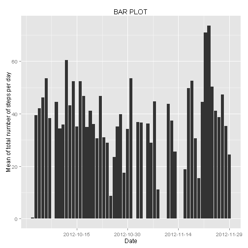
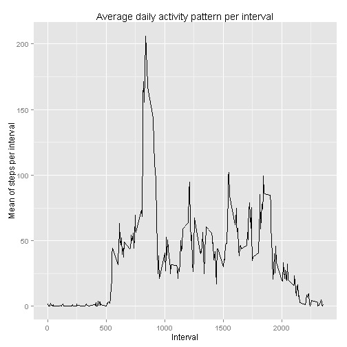
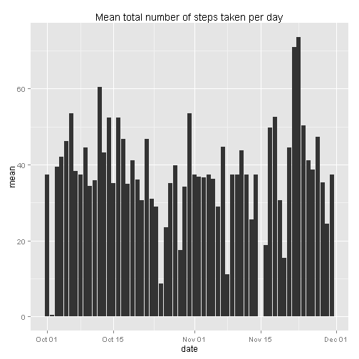
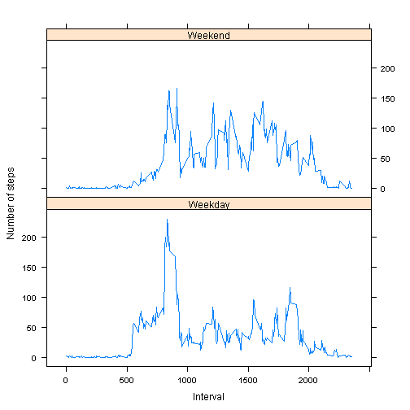

## Loading and preprocessing the data

```r
# Load the data file for assignment into Variable dataSet
dataSet<-read.csv("activity.csv")
# Load the libraries needed in the assignment.
library(plyr)
library(reshape2)
library(dplyr)
library(ggplot2)
library(tidyr)
library(knitr)
library(lattice)
```

## What is mean total number of steps taken per day?


```r
# Convert date column of data.frame to type Date
dataSet<-transform(dataSet,date=as.Date(dataSet$date))

# Proceeding to plot the histogram
dataSet%>%
group_by(date)%>%
summarise(mean=mean(steps,na.rm=TRUE)) %>%
    ggplot(aes(date,mean))+geom_bar(stat="identity") + 
    ggtitle("BAR PLOT") +
    scale_x_date(breaks=unique(dataSet$date)[seq(from=0,to=61,by=15)],name="Date") +
    scale_y_continuous("Mean of total number of steps per day")
```

```
## Warning: Removed 8 rows containing missing values (position_stack).
```

 

```r
dataSet%>%
    group_by(date)%>%
    summarise(mean=mean(steps,na.rm=TRUE),median=median(steps,na.rm=TRUE)) %>%
    kable()
```


|date       |       mean| median|
|:----------|----------:|------:|
|2012-10-01 |        NaN|     NA|
|2012-10-02 |  0.4375000|      0|
|2012-10-03 | 39.4166667|      0|
|2012-10-04 | 42.0694444|      0|
|2012-10-05 | 46.1597222|      0|
|2012-10-06 | 53.5416667|      0|
|2012-10-07 | 38.2465278|      0|
|2012-10-08 |        NaN|     NA|
|2012-10-09 | 44.4826389|      0|
|2012-10-10 | 34.3750000|      0|
|2012-10-11 | 35.7777778|      0|
|2012-10-12 | 60.3541667|      0|
|2012-10-13 | 43.1458333|      0|
|2012-10-14 | 52.4236111|      0|
|2012-10-15 | 35.2048611|      0|
|2012-10-16 | 52.3750000|      0|
|2012-10-17 | 46.7083333|      0|
|2012-10-18 | 34.9166667|      0|
|2012-10-19 | 41.0729167|      0|
|2012-10-20 | 36.0937500|      0|
|2012-10-21 | 30.6284722|      0|
|2012-10-22 | 46.7361111|      0|
|2012-10-23 | 30.9652778|      0|
|2012-10-24 | 29.0104167|      0|
|2012-10-25 |  8.6527778|      0|
|2012-10-26 | 23.5347222|      0|
|2012-10-27 | 35.1354167|      0|
|2012-10-28 | 39.7847222|      0|
|2012-10-29 | 17.4236111|      0|
|2012-10-30 | 34.0937500|      0|
|2012-10-31 | 53.5208333|      0|
|2012-11-01 |        NaN|     NA|
|2012-11-02 | 36.8055556|      0|
|2012-11-03 | 36.7048611|      0|
|2012-11-04 |        NaN|     NA|
|2012-11-05 | 36.2465278|      0|
|2012-11-06 | 28.9375000|      0|
|2012-11-07 | 44.7326389|      0|
|2012-11-08 | 11.1770833|      0|
|2012-11-09 |        NaN|     NA|
|2012-11-10 |        NaN|     NA|
|2012-11-11 | 43.7777778|      0|
|2012-11-12 | 37.3784722|      0|
|2012-11-13 | 25.4722222|      0|
|2012-11-14 |        NaN|     NA|
|2012-11-15 |  0.1423611|      0|
|2012-11-16 | 18.8923611|      0|
|2012-11-17 | 49.7881944|      0|
|2012-11-18 | 52.4652778|      0|
|2012-11-19 | 30.6979167|      0|
|2012-11-20 | 15.5277778|      0|
|2012-11-21 | 44.3993056|      0|
|2012-11-22 | 70.9270833|      0|
|2012-11-23 | 73.5902778|      0|
|2012-11-24 | 50.2708333|      0|
|2012-11-25 | 41.0902778|      0|
|2012-11-26 | 38.7569444|      0|
|2012-11-27 | 47.3819444|      0|
|2012-11-28 | 35.3576389|      0|
|2012-11-29 | 24.4687500|      0|
|2012-11-30 |        NaN|     NA|

## What is the average daily activity pattern?


```r
dataSet %>%
	group_by(interval) %>%
	summarise(mean=mean(steps,na.rm=TRUE)) %>%
	ggplot(aes(x=interval,y=mean),ymax=mean) + geom_line()  +
    scale_x_continuous(name="Interval") +
    scale_y_continuous(name="Mean of steps per interval") +
    ggtitle("Average daily activity pattern per interval")
```

 


```r
maxVal<-subset(dataSet,dataSet$steps==max(dataSet$steps,na.rm=TRUE))
sprintf("The 5 minute interval %d contains the maximum number of %d steps", maxVal$interval, maxVal$steps)
```

```
## [1] "The 5 minute interval 615 contains the maximum number of 806 steps"
```

## Inputing missing values

```r
sumOfNAs<-sum(is.na(dataSet))
sprintf("There are %d rows with missing values in the dataset", sumOfNAs)
```

```
## [1] "There are 2304 rows with missing values in the dataset"
```
### Proceeding to implement the following strategy to fill all of the missing values in the dataset
    * Identify the rows with missing values
    * Identify the mean values per interval for that row
    * Update the data set with the value

```r
    # Creating a new DataSet
    dataSetWithoutNAs<-dataSet
    # Function to calculate the mean value.
    # The input to the function is the dataSet and the interval for which mean has to be calculated
    meanPerInterval<-function(dataSet, intvl) mean(na.omit(subset(dataSet,dataSet$interval==intvl))$steps)
    # Identify the rows in the data set with missing values.
    nullRowIndex<-which(is.na(dataSetWithoutNAs))
    # Iterate through the rows
    for (i in nullRowIndex) {
        dataSetWithoutNAs[i,]$steps<-meanPerInterval(dataSetWithoutNAs,dataSetWithoutNAs[i,]$interval)
    }
```

```r
dataSetWithoutNAs%>%
group_by(date)%>%
summarise(mean=mean(steps,na.rm=TRUE)) %>%
ggplot(aes(date,mean))+geom_bar(stat="identity") + ggtitle("Mean total number of steps taken per day")
```

 

```r
dataSetWithoutNAs%>%
    group_by(date)%>%
    summarise(mean=mean(steps,na.rm=TRUE),median=median(steps,na.rm=TRUE)) %>%
    kable()
```


|date       |       mean|   median|
|:----------|----------:|--------:|
|2012-10-01 | 37.3825996| 34.11321|
|2012-10-02 |  0.4375000|  0.00000|
|2012-10-03 | 39.4166667|  0.00000|
|2012-10-04 | 42.0694444|  0.00000|
|2012-10-05 | 46.1597222|  0.00000|
|2012-10-06 | 53.5416667|  0.00000|
|2012-10-07 | 38.2465278|  0.00000|
|2012-10-08 | 37.3825996| 34.11321|
|2012-10-09 | 44.4826389|  0.00000|
|2012-10-10 | 34.3750000|  0.00000|
|2012-10-11 | 35.7777778|  0.00000|
|2012-10-12 | 60.3541667|  0.00000|
|2012-10-13 | 43.1458333|  0.00000|
|2012-10-14 | 52.4236111|  0.00000|
|2012-10-15 | 35.2048611|  0.00000|
|2012-10-16 | 52.3750000|  0.00000|
|2012-10-17 | 46.7083333|  0.00000|
|2012-10-18 | 34.9166667|  0.00000|
|2012-10-19 | 41.0729167|  0.00000|
|2012-10-20 | 36.0937500|  0.00000|
|2012-10-21 | 30.6284722|  0.00000|
|2012-10-22 | 46.7361111|  0.00000|
|2012-10-23 | 30.9652778|  0.00000|
|2012-10-24 | 29.0104167|  0.00000|
|2012-10-25 |  8.6527778|  0.00000|
|2012-10-26 | 23.5347222|  0.00000|
|2012-10-27 | 35.1354167|  0.00000|
|2012-10-28 | 39.7847222|  0.00000|
|2012-10-29 | 17.4236111|  0.00000|
|2012-10-30 | 34.0937500|  0.00000|
|2012-10-31 | 53.5208333|  0.00000|
|2012-11-01 | 37.3825996| 34.11321|
|2012-11-02 | 36.8055556|  0.00000|
|2012-11-03 | 36.7048611|  0.00000|
|2012-11-04 | 37.3825996| 34.11321|
|2012-11-05 | 36.2465278|  0.00000|
|2012-11-06 | 28.9375000|  0.00000|
|2012-11-07 | 44.7326389|  0.00000|
|2012-11-08 | 11.1770833|  0.00000|
|2012-11-09 | 37.3825996| 34.11321|
|2012-11-10 | 37.3825996| 34.11321|
|2012-11-11 | 43.7777778|  0.00000|
|2012-11-12 | 37.3784722|  0.00000|
|2012-11-13 | 25.4722222|  0.00000|
|2012-11-14 | 37.3825996| 34.11321|
|2012-11-15 |  0.1423611|  0.00000|
|2012-11-16 | 18.8923611|  0.00000|
|2012-11-17 | 49.7881944|  0.00000|
|2012-11-18 | 52.4652778|  0.00000|
|2012-11-19 | 30.6979167|  0.00000|
|2012-11-20 | 15.5277778|  0.00000|
|2012-11-21 | 44.3993056|  0.00000|
|2012-11-22 | 70.9270833|  0.00000|
|2012-11-23 | 73.5902778|  0.00000|
|2012-11-24 | 50.2708333|  0.00000|
|2012-11-25 | 41.0902778|  0.00000|
|2012-11-26 | 38.7569444|  0.00000|
|2012-11-27 | 47.3819444|  0.00000|
|2012-11-28 | 35.3576389|  0.00000|
|2012-11-29 | 24.4687500|  0.00000|
|2012-11-30 | 37.3825996| 34.11321|


```r
maxVal<-subset(dataSetWithoutNAs,dataSetWithoutNAs$steps==max(dataSetWithoutNAs$steps))
sprintf("The 5 minute interval %d contains the maximum number of %d steps", maxVal$interval, maxVal$steps)
```

```
## [1] "The 5 minute interval 615 contains the maximum number of 806 steps"
```
## Are there differences in activity patterns between weekdays and weekends?

```r
# Create a new column Day and assign it values "Weekday" or "Weekend" depending on
# the value of date. Using weekday() function for this.
rownum<-nrow(dataSetWithoutNAs)
for(i in 1:rownum) {
	dayType=weekdays(as.Date(dataSetWithoutNAs[i,]$date))
	if(dayType=="Sunday" || dayType=="Saturday") {
		dataSetWithoutNAs[i,4]<-"Weekend"
	} else {
		dataSetWithoutNAs[i,4]<-"Weekday"
	}
}
names(dataSetWithoutNAs)[4]<-"Day"

dataSetDays <- ddply(dataSetWithoutNAs,
              .(interval, Day), 
              summarize, 
              mean = mean(steps, na.rm=TRUE))
xyplot(mean~interval|Day,data=dataSetDays,
       type='l',layout=c(1,2),xlab="Interval",ylab="Number of steps") 
```

 


